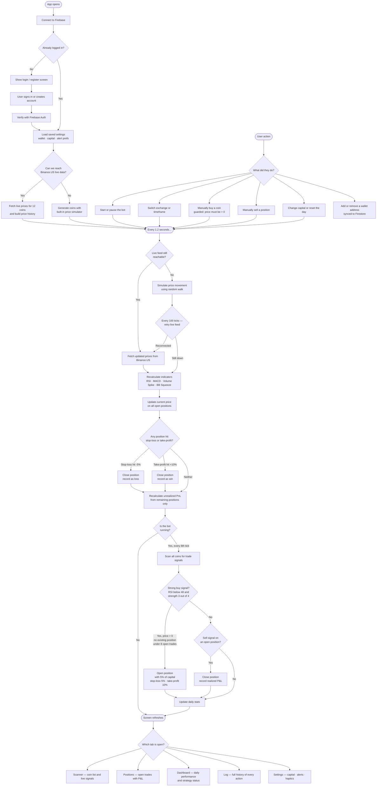

# NexusBot Flutter

## How It Works

```mermaid
flowchart TD
    A([App opens]) --> B[Connect to Firebase]
    B --> C{Already logged in?}

    C -- No --> D[Show login / register screen]
    D --> E[User signs in or creates account]
    E --> F[Verify with Firebase Auth]
    F --> G[Load saved settings\nwallet · capital · alert prefs]

    C -- Yes --> G

    G --> H{Can we reach\nBinance.US live data?}
    H -- Yes --> I[Fetch live prices for 12 coins\nand build price history]
    H -- No --> J[Generate coins with\nbuilt-in price simulator]

    I --> K
    J --> K

    K([Every 1.2 seconds...]) --> L{Live feed still\nreachable?}
    L -- Yes --> M[Fetch updated prices from Binance.US]
    L -- No --> N[Simulate price movement\nusing random walk]
    N --> NA{Every 100 ticks —\nretry live feed}
    NA -- Reconnected --> M
    NA -- Still down --> O

    M --> O[Recalculate indicators\nRSI · MACD · Volume Spike · BB Squeeze]

    O --> P[Update current price\non all open positions]

    P --> Q{Any position hit\nstop-loss or take-profit?}
    Q -- Stop-loss hit -5% --> R[Close position\nrecord as loss]
    Q -- Take-profit hit +10% --> S[Close position\nrecord as win]
    Q -- Neither --> T

    R --> T[Recalculate unrealized PnL\nfrom remaining positions only]
    S --> T

    T --> U{Is the bot\nrunning?}
    U -- No --> V[Update the screen]

    U -- Yes, every 8th tick --> W[Scan all coins for trade signals]

    W --> X{Strong buy signal?\nRSI below 48 and\nstrength 3 out of 4}
    X -- Yes, price > 0\nno existing position\nunder 8 open trades --> Y[Open position\nwith 5% of capital\nstop-loss 5% · take-profit 10%]
    Y --> Z

    X -- No --> AA{Sell signal on\nan open position?}
    AA -- Yes --> AB[Close position\nrecord realized P&L]
    AA -- No --> Z

    AB --> Z[Update daily stats]
    Z --> V

    V([Screen refreshes]) --> AC{Which tab is open?}

    AC --> AD[Scanner — coin list and live signals]
    AC --> AE[Positions — open trades with P&L]
    AC --> AF[Dashboard — daily performance\nand strategy status]
    AC --> AG[Log — full history of every action]
    AC --> AH[Settings — capital · alerts · haptics]

    AI([User action]) --> AJ{What did they do?}
    AJ --> AK[Start or pause the bot]
    AJ --> AL[Switch exchange or timeframe]
    AJ --> AM[Manually buy a coin\nguarded: price must be > 0]
    AJ --> AN[Manually sell a position]
    AJ --> AO[Change capital or reset the day]
    AJ --> AP[Add or remove a wallet address\nsynced to Firestore]

    AK & AL & AM & AN & AO --> K
```
