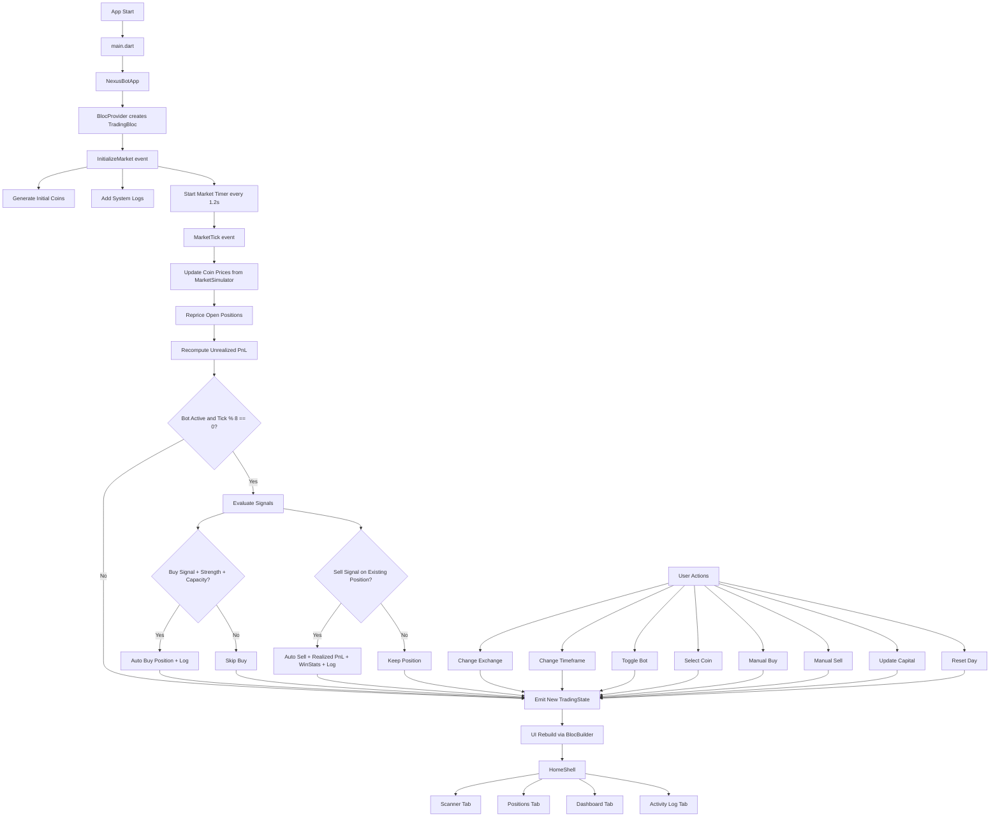

# NexusBot Flutter

## App Flow Chart

```mermaid
flowchart TD
    A[App Start] --> B[main.dart]
    B --> C[NexusBotApp]
    C --> D[BlocProvider creates TradingBloc]
    D --> E[InitializeMarket event]
    E --> F[Generate Initial Coins]
    E --> G[Add System Logs]
    E --> H[Start Market Timer every 1.2s]

    H --> I[MarketTick event]
    I --> J[Update Coin Prices from MarketSimulator]
    J --> K[Reprice Open Positions]
    K --> L[Recompute Unrealized PnL]
    L --> M{Bot Active and Tick % 8 == 0?}
    M -- No --> N[Emit New TradingState]
    M -- Yes --> O[Evaluate Signals]
    O --> P{Buy Signal + Strength + Capacity?}
    P -- Yes --> Q[Auto Buy Position + Log]
    P -- No --> R[Skip Buy]
    O --> S{Sell Signal on Existing Position?}
    S -- Yes --> T[Auto Sell + Realized PnL + WinStats + Log]
    S -- No --> U[Keep Position]
    Q --> N
    R --> N
    T --> N
    U --> N

    N --> V[UI Rebuild via BlocBuilder]
    V --> W[HomeShell]
    W --> X[Scanner Tab]
    W --> Y[Positions Tab]
    W --> Z[Dashboard Tab]
    W --> AA[Activity Log Tab]

    AB[User Actions] --> AC[Change Exchange]
    AB --> AD[Change Timeframe]
    AB --> AE[Toggle Bot]
    AB --> AF[Select Coin]
    AB --> AG[Manual Buy]
    AB --> AH[Manual Sell]
    AB --> AI[Update Capital]
    AB --> AJ[Reset Day]

    AC --> N
    AD --> N
    AE --> N
    AF --> N
    AG --> N
    AH --> N
    AI --> N
    AJ --> N
```
